# Stock Marketplace

A comprehensive stock market dashboard application built with Next.js 16, offering real-time market data, interactive charts, and personalized watchlist management.

## 🚀 Features

- **Real-Time Market Dashboard**: Visualize market trends with interactive TradingView widgets.
  - **Market Overview**: Snapshot of global market performance.
  - **Stock Heatmap**: Visual representation of stock performance across sectors.
  - **Top Stories**: Real-time news timeline.
  - **Market Quotes**: Live quotes for major indices and stocks.
- **Secure Authentication**: Robust sign-up and sign-in functionality powered by `better-auth`.
- **Personalized Watchlist**: Add and manage your favorite stocks to track their performance.
- **Stock Search**: Efficient search functionality to find stocks by symbol or company name.
- **Detailed Stock Analysis**: Dedicated pages for individual stock data (under development).

## 🛠️ Tech Stack

- **Framework**: [Next.js 16](https://nextjs.org/) (React 19)
- **Database**: [MongoDB](https://www.mongodb.com/) with Mongoose
- **Styling**: [Tailwind CSS v4](https://tailwindcss.com/) & [Radix UI](https://www.radix-ui.com/)
- **Authentication**: [Better Auth](https://www.better-auth.com/)
- **Icons**: [Lucide React](https://lucide.dev/)
- **Widgets**: [TradingView Widgets](https://www.tradingview.com/widget/)

## 🔄 Project Flow

The following diagram illustrates the primary user flow within the specific features of the application:

```mermaid
sequenceDiagram
    actor User
    participant Auth as Auth System
    participant Dash as Dashboard
    participant Search as Search Component
    participant DB as MongoDB

    User->>Auth: Sign Up / Sign In
    Auth-->>User: Session Token
    User->>Dash: Access Dashboard
    Dash->>User: Display Market Overview, Heatmap, News
    
    rect rgb(30, 30, 30)
        note right of User: Watchlist Feature
        User->>Search: Search for Stock (e.g., AAPL)
        Search-->>User: Show Results
        User->>Dash: Click "Add to Watchlist"
        Dash->>DB: Save Watchlist Item via Server Action
        DB-->>Dash: Confirmation
    end
```



## 📂 Folder Structure

- **`app/`**: Application routes and pages.
  - **`(auth)/`**: Authentication routes (Sign-in, Sign-up).
  - **`(root)/`**: Main application routes (Dashboard, Stocks).
  - **`api/`**: API route handlers.
- **`components/`**: Reusable UI components (Widgets, Forms, UI primitives).
- **`database/`**: Database connection and Mongoose models (`watchlist.model.ts`).
- **`lib/`**: Utility functions and constants.
- **`types/`**: TypeScript type definitions.

## 🏁 Getting Started

### Prerequisites

- Node.js (v18 or higher recommended)
- MongoDB instance (Local or Atlas)

### Installation

1.  **Clone the repository:**
    ```bash
    git clone <repository-url>
    cd stock-marketplace
    ```

2.  **Install dependencies:**
    ```bash
    npm install
    # or
    yarn install
    # or
    pnpm install
    ```

3.  **Set up Environment Variables:**
    
    Copy the example environment file:
    ```bash
    cp .env.example .env
    ```
    
    Open `.env` and fill in the required values:

    | Variable | Description |
    |----------|-------------|
    | `MONGODB_URI` | MongoDB connection string. |
    | `BETTER_AUTH_SECRET` | Secret for session signing (`openssl rand -base64 32`). |
    | `BETTER_AUTH_URL` | App URL (e.g., `http://localhost:3000`). |
    | `NODEMAILER_EMAIL` | Email for sending notifications. |
    | `NODEMAILER_PASSWORD` | App password for the email account. |
    | `NEXT_PUBLIC_FINNHUB_API_KEY` | Finnhub API key (client-side). |
    | `FINNHUB_API_KEY` | Finnhub API key (server-side). |
    | `GEMINI_API_KEY` | Google Gemini API key for AI features. |

4.  **Run the development server:**
    ```bash
    npm run dev
    ```

5.  **Open the app:**
    Navigate to [http://localhost:3000](http://localhost:3000) in your browser.

## 🤝 Contributing

Contributions are welcome! Please feel free to submit a Pull Request.
