# Stock Marketplace

A comprehensive, AI-powered stock market dashboard application built with Next.js 16. The application offers real-time market data, interactive charts, personalized watchlist management, and intelligent background services for news and notifications.

## 🚀 Features

### 📊 Real-Time Market Dashboard
- **Market Overview**: Instant snapshot of global market performance.
- **Stock Heatmap**: Visual representation of stock performance across sectors.
- **Top Stories**: Real-time news timeline to stay updated with global events.
- **Market Quotes**: Live quotes for major indices and stocks.

### 🤖 AI-Powered Intelligence
- **Smart News Summaries**: Receive daily, personalized news summaries relevant to your watchlist, powered by **Google Gemini**.
- **Personalized Onboarding**: AI-generated welcome emails tailored to your investment goals and risk tolerance.

### 🔔 Notifications & Alerts
- **Price Alerts (Beta)**: Set custom price thresholds for specific stocks to get notified when targets are met.
- **Email Notifications**: Integration with **Nodemailer** for reliable delivery of reliable updates and news.

### 👤 User Experience
- **Secure Authentication**: Robust sign-up and sign-in functionality powered by **Better Auth**.
- **Personalized Watchlist**: Add and manage your favorite stocks to track their performance.
- **Stock Search**: Efficient search functionality to find stocks by symbol or company name.
- **Responsive Design**: Fully responsive UI built with **Tailwind CSS v4** and **Radix UI components**.

---

## 🛠️ Tech Stack

- **Framework**: [Next.js 16](https://nextjs.org/) (React 19)
- **Database**: [MongoDB](https://www.mongodb.com/) with Mongoose
- **Styling**: [Tailwind CSS v4](https://tailwindcss.com/) & [Radix UI](https://www.radix-ui.com/)
- **Authentication**: [Better Auth](https://www.better-auth.com/)
- **AI & ML**: [Google Gemini](https://deepmind.google/technologies/gemini/) (Generative AI)
- **Background Jobs**: [Inngest](https://www.inngest.com/) (Serverless Queues & Cron Jobs)
- **Market Data**: [Finnhub API](https://finnhub.io/)
- **Communication**: [Nodemailer](https://nodemailer.com/)
- **Icons**: [Lucide React](https://lucide.dev/)
- **Widgets**: [TradingView Widgets](https://www.tradingview.com/widget/)

---

## 🔄 Project Architecture

### Data & User Flow
The following diagram illustrates the primary user flows for the Dashboard and Watchlist, as well as the Background AI Jobs:

```mermaid
sequenceDiagram
    actor User
    participant Auth as Auth System
    participant Dash as Dashboard
    participant DB as MongoDB
    participant Inngest as Inngest (Jobs)
    participant AI as Gemini AI
    participant Email as Email Service

    User->>Auth: Sign Up / Sign In
    Auth-->>User: Session Token
    
    rect rgb(30, 30, 30)
        note right of User: Dashboard Actions
        User->>Dash: Access Dashboard
        Dash->>User: Display Overview, Heatmap, News
        User->>Dash: Add Stock to Watchlist
        Dash->>DB: Save Watchlist Item via Server Action
    end

    rect rgb(0, 50, 50)
        note right of User: Background Automation
        Inngest->>DB: Fetch Users & Watchlists (Cron Job)
        DB-->>Inngest: User Data
        Inngest->>AI: Generate Personalized News Summary
        AI-->>Inngest: Summary Text
        Inngest->>Email: Send Daily Summary Email
        Email-->>User: Receive Market Update
    end
```



---

## 📂 Folder Structure

- **`app/`**: Application routes and pages.
  - **`(auth)/`**: Authentication routes (Sign-in, Sign-up).
  - **`(root)/`**: Main application routes (Dashboard, Watchlist, Stocks).
  - **`api/`**: API route handlers (including Inngest webhooks).
- **`components/`**: Reusable UI components.
  - **`ui/`**: Base UI primitives (buttons, inputs, dialogs).
- **`database/`**: Database connection and Mongoose models (`alert.model.ts`, `watchlist.model.ts`, etc.).
- **`lib/`**: Business logic and utilities.
  - **`actions/`**: Server Actions for data fetching and mutations.
  - **`inngest/`**: Background job definitions and AI prompts.
- **`types/`**: TypeScript type definitions.
- **`public/`**: Static assets.

---

## 🏁 Getting Started

### Prerequisites

- Node.js (v18 or higher recommended)
- MongoDB instance (Local or Atlas)
- Accounts/API Keys for:
  - Google Gemini (AI)
  - Finnhub (Market Data)
  - SMTP Service (e.g., Gmail, Resend) for Nodemailer

### Installation

1.  **Clone the repository:**
    ```bash
    git clone <repository-url>
    cd stock-marketplace
    ```

2.  **Install dependencies:**
    ```bash
    npm install
    # or
    yarn install
    # or
    pnpm install
    ```

3.  **Set up Environment Variables:**
    
    Copy the example environment file:
    ```bash
    cp .env.example .env
    ```
    
    Open `.env` and fill in the required values:

    | Variable | Description |
    |----------|-------------|
    | `MONGODB_URI` | MongoDB connection string. |
    | `BETTER_AUTH_SECRET` | Secret for session signing (`openssl rand -base64 32`). |
    | `BETTER_AUTH_URL` | App URL (e.g., `http://localhost:3000`). |
    | `NODEMAILER_EMAIL` | Email for sending notifications. |
    | `NODEMAILER_PASSWORD` | App password for the email account. |
    | `NEXT_PUBLIC_FINNHUB_API_KEY` | Finnhub API key (client-side). |
    | `FINNHUB_API_KEY` | Finnhub API key (server-side). |
    | `GEMINI_API_KEY` | Google Gemini API key for AI features. |

4.  **Run the development server and Inngest:**
    
    Start the Next.js app:
    ```bash
    npm run dev
    ```

    In a separate terminal, start the Inngest Dev Server (optional, for testing background jobs):
    ```bash
    npm run inngest
    ```

5.  **Open the app:**
    Navigate to [http://localhost:3000](http://localhost:3000) in your browser.

    To view Inngest dashboard:
    Navigate to [http://localhost:8288](http://localhost:8288).

---

## 🤝 Contributing

Contributions are welcome! Please feel free to submit a Pull Request.
